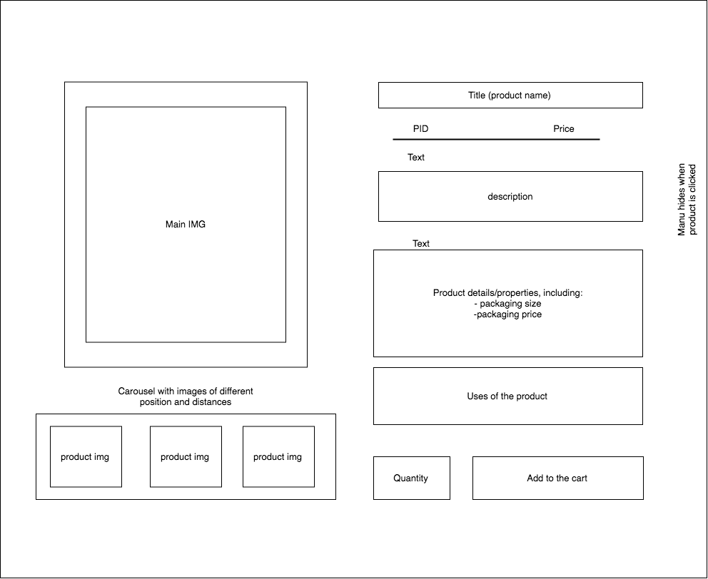

# PRUEBA TÉCNICA CYMIT (FONT-END SIDE)

## Preguntas

###  HTML

Para resaltar visualmente un texto se puede usar `<b>` (bold) que es el tag usado para convertir el texto en negrita (aunque se recomienda modificar la propiedad "font-weight" desde la hoja de estilos CSS y no desde el HTML). No obstante, para resaltar semánticamente el texto dentro del documento HTML usaremos el tag `<strong>` que describe como debe tratarse ese fragmento de texto respecto al resto. Por ejemplo, en páginas adaptadas a personas con discapacidad visual, usar la etiqueta `<strong>` puede servir para modificar el tono del lector de voz en dicha parte y así facilitar la interpretación del texto al usuario.

### CSS

El preprocesador de CSS nos permite escribir pseudocódigo (usar variables, funciones, condicionales...) lo cual es útil para sacar factor común en piezas de código repetidas, simplificar nuestro código y facilitar su legibilidad. Esto puede resultar especialmente útil en proyectos grandes y con amplias zonas de código análogo. No obstante, su abuso puede acabar en justo lo contrario de lo que buscamos, como exceso de anidaciones o la creación de selectores poco óptimos que incrementan el peso del archivo.

### Promesas/callback

Las promesas se construyen sobre las callbacks y nos permiten tener un código más limpio e inteligible cuando se producen repetidas llamadas anidadas, por ejemplo.

### Usabilidad web Cymit

A nivel de usabilidad, la más evidente desde mi punto de vista (estoy con el móbil) es que el diseño de la página web no es responsive. Si la abres desde el móvil o reduces el tamaño del navegador, no hay ningún elemento del layout que se adapte al tamaño de la pantalla, lo cual sumado a la estética de web antigua emprobrece la experiencia del usuario. 

Por otra parte la página sufre "divitis", es decir, la gran mayoría de los tags usados dentro de la página son `
`, lo cual no beneficia ni la semántica del documento HTML, ni ayuda a los aparatos de búsqueda a filtrar el contenido de la página de una forma más eficiente. A modo de ejemplo, en vez de usar el tag `
` y luego añadirle la clase "header" podríamos poner el tag `<header>` de entrada y así añadir semática a nuestro HTML.

En relación a los preprocesadores, veo que hay zonas del css que repiten mucho código. Supongo que se podría refactorizar el código y eliminar las partes que se repiten sacando factor común.

Otros detalles que veo, sin entrar demasiado en profundidad, es hacer transiciones en el CSS. Por ejemplo, el despliegue de los menus en la cabecera de navegación es muy brusca: si desplazamos el ratón por la ventana de productos, se despliega un menú gigante de golpe. Se podría subdividir el menú para reducir su tamaño y hacer que el despliegue sea menos brusco usando transiciones.

## Desarrollo

### Ejercicio 3

